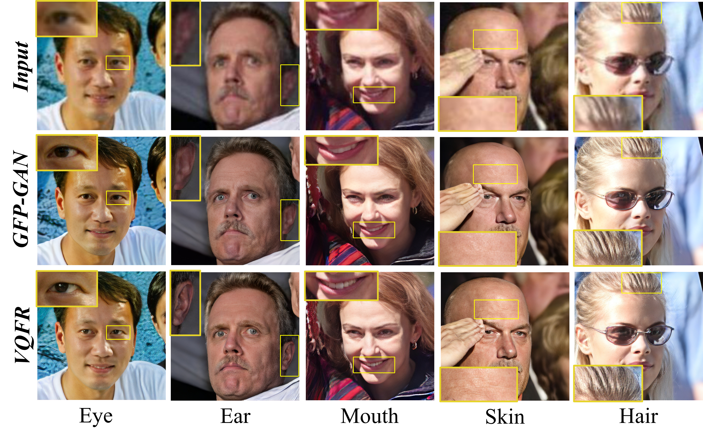

# VQFR (ECCV 2022 Oral)

[](https://github.com/TencentARC/VQFR/releases)
[](https://github.com/TencentARC/VQFR/issues)
[](https://github.com/TencentARC/VQFR/issues)
[](https://github.com/TencentARC/VQFR/blob/master/LICENSE)
<a href="https://colab.research.google.com/drive/1Nd_PUrHaYmeEAOF5f_Zi0VuOxlJ62gLr?usp=sharing"></a>


1. [Colab Demo](https://colab.research.google.com/drive/1Nd_PUrHaYmeEAOF5f_Zi0VuOxlJ62gLr?usp=sharing) for VQFR
1. Online demo: [Replicate.ai](https://replicate.com/tencentarc/vqfr) (may need to sign in, return the whole image)

:triangular_flag_on_post: **Updates**

- :white_check_mark: **2022.10.16** Clean research codes & Update VQFR-v2. In this version, we emphasize the restoration **quality** of the texture branch and **balance fidelity with user control**. <a href="https://colab.research.google.com/drive/1Nd_PUrHaYmeEAOF5f_Zi0VuOxlJ62gLr?usp=sharing"></a>

- :white_check_mark: Support enhancing non-face regions (background) with [Real-ESRGAN](https://github.com/xinntao/Real-ESRGAN).
- :white_check_mark: The Colab Demo of VQFR is created.
- :white_check_mark: The training/inference codes and pretrained models in paper are released.

This paper aims at investigating the **potential and limitation of Vector-Quantized (VQ) dictionary** for blind face restoration.
<br>
We propose a new framework VQFR – incoporating the **Vector-Quantized Dictionary** and the **Parallel Decoder**.
Compare with previous arts, VQFR produces more realistic facial details and keep the comparable fidelity.

---

### VQFR: Blind Face Restoration with Vector-Quantized Dictionary and Parallel Decoder

> [[Paper](https://arxiv.org/abs/2205.06803)] &emsp; [[Project Page](https://ycgu.site/projects/vqfr)] &emsp; [Video] &emsp; [B站] &emsp; [Poster] &emsp; [Slides]<br>
> [Yuchao Gu](https://ycgu.site/), [Xintao Wang](https://xinntao.github.io/), [Liangbin Xie](https://liangbinxie.github.io/), [Chao Dong](https://scholar.google.com.hk/citations?user=OSDCB0UAAAAJ), Gen Li, [Ying Shan](https://scholar.google.com/citations?user=4oXBp9UAAAAJ&hl=en),
[Ming-Ming Cheng](https://scholar.google.com/citations?user=huWpVyEAAAAJ&hl=en)<br>
> Nankai University; Tencent ARC Lab; Tencent Online Video; Shanghai AI Laboratory;<br>
Shenzhen Institutes of Advanced Technology, Chinese Academy of Sciences

<p align="center">
  
</p>

---

## :wrench: Dependencies and Installation

- Python >= 3.7 (Recommend to use [Anaconda](https://www.anaconda.com/download/#linux) or [Miniconda](https://docs.conda.io/en/latest/miniconda.html))
- [PyTorch >= 1.7](https://pytorch.org/)
- Option: NVIDIA GPU + [CUDA](https://developer.nvidia.com/cuda-downloads)
- Option: Linux

### Installation

1. Clone repo

    ```bash
    git clone https://github.com/TencentARC/VQFR.git
    cd VQFR
    ```

1. Install dependent packages

    ```bash
    # Build VQFR with extension
    pip install -r requirements.txt
    VQFR_EXT=True python setup.py develop

    # Following packages are required to run demo.py

    # Install basicsr - https://github.com/xinntao/BasicSR
    pip install basicsr

    # Install facexlib - https://github.com/xinntao/facexlib
    # We use face detection and face restoration helper in the facexlib package
    pip install facexlib

    # If you want to enhance the background (non-face) regions with Real-ESRGAN,
    # you also need to install the realesrgan package
    pip install realesrgan
    ```

## :zap: Quick Inference

Download pre-trained **VQFRv1/v2 models** [[Google Drive](https://drive.google.com/drive/folders/1lczKYEbARwe27FJlKoFdng7UnffGDjO2?usp=sharing)].

**Inference**

```bash
# for real-world image
python demo.py -i inputs/whole_imgs -o results -v 2.0 -s 2 -f 0.1

# for cropped face
python demo.py -i inputs/cropped_faces/ -o results -v 2.0 -s 1 -f 0.1 --aligned
```

```console
Usage: python demo.py -i inputs/whole_imgs -o results -v 2.0 -s 2 -f 0.1 [options]...

  -h                   show this help
  -i input             Input image or folder. Default: inputs/whole_imgs
  -o output            Output folder. Default: results
  -v version           VQFR model version. Option: 1.0. Default: 1.0
  -f fidelity_ratio    VQFRv2 model supports user control fidelity ratio, range from [0,1]. 0 for the best quality and 1 for the best fidelity. Default: 0
  -s upscale           The final upsampling scale of the image. Default: 2
  -bg_upsampler        background upsampler. Default: realesrgan
  -bg_tile             Tile size for background sampler, 0 for no tile during testing. Default: 400
  -suffix              Suffix of the restored faces
  -only_center_face    Only restore the center face
  -aligned             Input are aligned faces
  -ext                 Image extension. Options: auto | jpg | png, auto means using the same extension as inputs. Default: auto
```

## :computer: Training

We provide the training codes for VQFR (used in our paper).

- Dataset preparation: [FFHQ](https://github.com/NVlabs/ffhq-dataset)
- Download lpips weights [[Google Drive](https://drive.google.com/drive/folders/1weXfn5mdIwp2dEfDbNNUkauQgo8fx-2D?usp=sharing)] into **experiments/pretrained_models/**

**Codebook Training**

- Pre-train VQ codebook on FFHQ datasets.
```bash
 python -m torch.distributed.launch --nproc_per_node=8 --master_port=2022 vqfr/train.py -opt options/train/VQGAN/train_vqgan_v1_B16_800K.yml --launcher pytorch
```

- Or download our pretrained **VQ codebook** [Google Drive](https://drive.google.com/drive/folders/1lczKYEbARwe27FJlKoFdng7UnffGDjO2?usp=sharing) and put them in the `experiments/pretrained_models` folder.

**Restoration Training**

- Modify the configuration file `options/train/VQFR/train_vqfr_v1_B16_200K.yml` accordingly.

- Training
```bash
python -m torch.distributed.launch --nproc_per_node=8 --master_port=2022 vqfr/train.py -opt options/train/VQFR/train_vqfr_v1_B16_200K.yml --launcher pytorch
```

## :straight_ruler: Evaluation

We evaluate VQFR on one synthetic dataset **CelebA-Test**, and three real-world datasets **LFW-Test**, **CelebChild** and **Webphoto-Test**.
For reproduce our evaluation results, you need to perform the following steps:

1. Download testing datasets (or VQFR results) by the following links:

<table>
<tr>
    <th>Name</th>
    <th>Datasets</th>
    <th>Short Description</th>
    <th>Download</th>
    <th>VQFR Results</th>
</tr>
<tr>
    <td rowspan="5">Testing Datasets</td>
    <td>CelebA-Test(LQ/HQ)</td>
    <td><sub>3000 (LQ, HQ) synthetic images for testing</sub></td>
    <td rowspan="4"><a href="https://drive.google.com/drive/folders/1CPdaCijkhl8ojg9ZDCPXntQrnw-8tUeD?usp=sharing">Google Drive</a> </td>
    <td rowspan="4"><a href="https://drive.google.com/drive/folders/1w-qo5BsKBzSmE0hwS9Hl5G9fn4VKVweU?usp=sharing">Google Drive</a> </td>
</tr>
<tr>
    <td>LFW-Test(LQ)</td>
    <td><sub>1711 real-world images for testing</sub></td>
</tr>
<tr>
    <td>CelebChild(LQ)</td>
    <td><sub>180 real-world images for testing</sub></td>
</tr>
<tr>
    <td>Webphoto-Test(LQ)</td>
    <td><sub>469 real-world images for testing</sub></td>
</tr>
</table>

2. Install related package and download pretrained models for different metrics:

```bash
    # LPIPS
    pip install lpips

    # Deg.
    cd metric_paper/
    git clone https://github.com/ronghuaiyang/arcface-pytorch.git
    mv arcface-pytorch/ arcface/
    rm arcface/config/__init__.py arcface/models/__init__.py

    # put pretrained models of different metrics to "experiments/pretrained_models/metric_weights/"
```
<table>
<tr>
    <th>Metrics</th>
    <th>Pretrained Weights</th>
    <th>Download</th>
</tr>
<tr>
    <td>FID</td>
    <td>inception_FFHQ_512.pth</td>
    <td rowspan="3"><a href="https://drive.google.com/drive/folders/1k3RCSliF6PsujCMIdCD1hNM63EozlDIZ?usp=sharing">Google Drive</a> </td>
</tr>
<tr>
    <td>Deg</td>
    <td>resnet18_110.pth</td>
</tr>
<tr>
    <td>LMD</td>
    <td>alignment_WFLW_4HG.pth</td>
</tr>
</table>

3. Generate restoration results:

- Specify the dataset_lq/dataset_gt to the testing dataset root in **test_vqfr_v1.yml**.

- Then run the following command:
```bash
    python vqfr/test.py -opt options/test/VQFR/test_vqfr_v1.yml
```

4. Run evaluation:
```bash
    # LPIPS|PSNR/SSIM|LMD|Deg.
    python metric_paper/[calculate_lpips.py|calculate_psnr_ssim.py|calculate_landmark_distance.py|calculate_cos_dist.py]
    -restored_folder folder_to_results -gt_folder folder_to_gt

    # FID|NIQE
    python metric_paper/[calculate_fid_folder.py|calculate_niqe.py] -restored_folder folder_to_results
```

## :scroll: License

VQFR is released under Apache License Version 2.0.

## :eyes: Acknowledgement

Thanks to the following open-source projects:

[Taming-transformers](https://github.com/CompVis/taming-transformers)

[GFPGAN](https://github.com/TencentARC/GFPGAN)

[DistSup](https://github.com/distsup/DistSup)


## :clipboard: Citation

    @inproceedings{gu2022vqfr,
      title={VQFR: Blind Face Restoration with Vector-Quantized Dictionary and Parallel Decoder},
      author={Gu, Yuchao and Wang, Xintao and Xie, Liangbin and Dong, Chao and Li, Gen and Shan, Ying and Cheng, Ming-Ming},
      year={2022},
      booktitle={ECCV}
    }

## :e-mail: Contact

If you have any question, please email `yuchaogu9710@gmail.com`.
